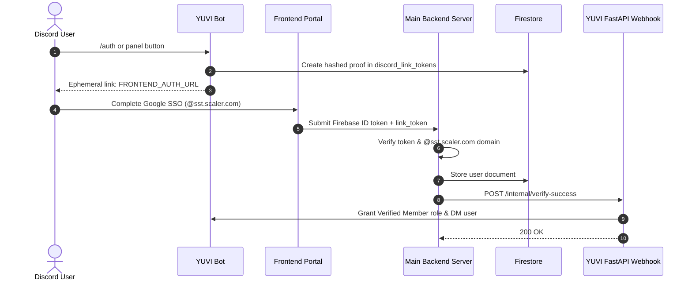

# YUVI

Discord bot and FastAPI backend service for Reinforce Club SST. Handles Google account authentication (@sst.scaler.com), role assignment, and a Firestore-synchronized support ticket and project management system.

---

## Project Structure

```text
YUVI/
├── cogs/
│   ├── auth.py               # Authentication slash commands & verification views
│   └── tickets.py            # Ticket panel, thread lifecycle & chat syncing
├── models/
│   ├── __init__.py
│   └── ticket.py             # Ticket schemas, status enums & Firestore serialization
├── utils/
│   ├── __init__.py
│   ├── firestore_client.py   # Shared Firestore client initializer
│   ├── ticket_manager.py     # Async database CRUD for tickets & messages
│   ├── transcript_generator.py # Formats chat history into text transcripts
│   └── user_manager.py       # User profile lookups and unlinking
├── views/
│   ├── __init__.py
│   ├── ticket_panel.py       # Persistent category dropdown view
│   ├── ticket_modals.py      # Category-specific intake modals
│   └── ticket_controls.py   # Thread controls (claim, add member, close, transcript)
├── serviceAccountKey.json    # Firebase Admin credentials
├── server.py                 # FastAPI application, lifecycle manager & webhook routes
├── yuvi_bot.py               # Custom commands.Bot subclass
├── main.py                   # Uvicorn entry point
└── pyproject.toml            # Dependencies and project metadata
```

---

## Member Authentication

### Workflow
1. A user triggers `/auth`, `/login`, or clicks the button on the `/setup-auth` verification panel.
2. The bot creates a private one-time proof from the Discord interaction. Existing members can repeat this flow to retry role assignment.
3. The bot returns an ephemeral link button, valid for ten minutes, pointing to:
   ```text
   {FRONTEND_AUTH_URL}#link_token={private_one_time_token}
   ```
4. The user completes Google OAuth with their `@sst.scaler.com` account on the frontend.
5. The main backend validates the Firebase token, verified email domain, one-time proof, and duplicate accounts, then atomically saves the profile to Firestore under `users/{discord_id}`, and issues a POST request to YUVI's internal webhook.
6. YUVI assigns the verified role to the user and sends a confirmation DM.



### Webhook Specification

- **Endpoint**: `POST /internal/verify-success`
- **Headers**: `X-Internal-Secret: <string>` (required; missing server configuration fails closed)
- **Body**:
  ```json
  {
    "discord_id": "123456789012345678",
    "email": "student@sst.scaler.com",
    "name": "Full Name"
  }
  ```
- **Response**:
  ```json
  {
    "success": true,
    "discord_id": "123456789012345678",
    "email": "student@sst.scaler.com",
    "role_granted": "Verified Member",
    "role_assigned": true
  }
  ```

---

## Ticket & SPG System

Tickets are stored in Firestore under `tickets/{ticket_id}` and conversations are recorded in `tickets/{ticket_id}/messages/{message_id}` in real time. This keeps Discord threads and the web dashboard in sync.

The dashboard bridge accepts `POST /tickets/create-thread` to create a private
Discord thread for an existing ticket and `POST /tickets/relay-message` to post a
dashboard message to its linked thread. Both require `X-Internal-Secret` matching
`BOT_INTERNAL_SECRET`. The older `/internal/tickets/*` aliases use the same checks.
Thread creation reserves the ticket before calling Discord and can resume a
partially completed setup without creating a duplicate thread.

### Categories & Modals

| Category | Purpose | Modal Fields |
|---|---|---|
| **SPG Registration / Modification** | Register or update a Student Project Group (Product, Kaggle, Research) | Project Name & Track, Leader & Members, Estimated Duration, Goals & Next Steps |
| **Resource Request** | Request compute/GPU, hardware, API credits, mentorship | Project Name, Resources Needed, Progress Proof Links, Justification |
| **Support & Inquiries** | General questions regarding club tracks, events, activities | Subject, Details |
| **Idea Jar & Suggestions** | Propose ideas for others to build or general club feedback | Idea Title, Track, Learning Objectives & Description |
| **Report Issue / Misconduct** | Confidential reports for rule violations or disputes | Incident Summary, Confidential Details |
| **General / Misc** | Miscellaneous requests | Subject, Details |

---

## Commands Reference

### Authentication Commands
- `/setup-auth [channel]`: Deploys the persistent verification panel with a click-to-verify button. (Admin)
- `/auth` (or `/login`): Sends an ephemeral login link to the user.
- `/whois <member>`: Displays linked Google account information from Firestore. (Admin)
- `/whois-email <email>`: Looks up which Discord ID is linked to a given student email. (Admin)
- `/unlink <member>`: Deletes the user's Firestore record and strips their verified role. (Admin)

### Ticket Commands
- `/setup-tickets [channel]`: Deploys the ticket creation panel with the category dropdown. (Admin)
- `/ticket close [reason]`: Closes the ticket, archives the thread, and generates a transcript.
- `/ticket claim`: Assigns the current ticket to the executing admin/lead.
- `/ticket add <member>`: Adds another member to the private ticket thread.
- `/ticket remove <member>`: Removes a member from the private ticket thread.
- `/ticket transcript`: Exports and sends the full text transcript of the active ticket.
- `/ticket info`: Displays database metadata for the active ticket.
- `/ticket list [status] [category]`: Lists tickets matching filter criteria from Firestore. (Admin)

### Idea Jar Commands
- `/setup-ideajar [channel]`: Deploys the persistent Idea Jar panel with "Get Random Idea" and "Submit an Idea" buttons. (Admin)
- `/idea get <idea_id>`: Displays full details of an idea by its unique ID.
- `/idea random [track] [difficulty]`: Pulls a random approved project idea from the Idea Jar.
- `/idea list [track] [status]`: Lists ideas matching filter criteria.
- `/idea approve <idea_id>`: Approves a submitted user idea. (Admin)
- `/idea delete <idea_id>`: Deletes an idea from the database. (Admin)

---

## Setup & Execution

### 1. Environment Configuration
Copy `.env.example` to `.env` and configure the values:

```bash
cp .env.example .env
```

Key variables:
- `DISCORD_TOKEN`: Discord Bot Token.
- `GUILD_ID`: Target Discord server ID.
- `VERIFIED_ROLE_ID`: Role ID to assign upon successful authentication.
- `FRONTEND_AUTH_URL`: Base URL for the frontend Google auth page.
- `TICKETS_CHANNEL_ID`: Channel where private ticket threads are opened.
- `ADMIN_ROLE_ID` / `SUPPORT_ROLE_ID`: Staff role IDs for alerts and ticket management.
- `TRANSCRIPTS_CHANNEL_ID`: Channel ID to upload transcripts upon ticket closure.
- `BOT_INTERNAL_SECRET`: Required shared secret for the `/internal/verify-success` webhook.
- `GOOGLE_APPLICATION_CREDENTIALS`: Path to Firebase service account JSON.

### 2. Running the Application
Start the Uvicorn server (which concurrently manages the FastAPI endpoints and Discord bot):

```bash
python main.py
```

Or run directly with Uvicorn:
```bash
uvicorn server:app --host 0.0.0.0 --port 8000
```

## Coordinated secure-link rollout

Deploy with the matching Dashboard API/web PR; `FRONTEND_AUTH_URL` must point to
the Next.js `web/` `/auth` page, not the legacy client. Old numeric-ID links no
longer establish ownership. Existing members run `/auth` again to receive proof.

`discord_link_tokens/{sha256(token)}` stores `discord_id`, native timestamp
`issued_at`, native timestamp `expires_at` (ten minutes), and `consumed_by: null`.
The API consumes it transactionally, adding `consumed_by` (Firebase UID), `email`,
and `consumed_at`, and sets `discord_link_version: 1` on both `users/{email}` and
`users/{discord_id}`. The webhook checks both records as well as the shared secret.
Client Firestore rules must deny access to this collection and writes to user
records. Optional TTL on `expires_at` is for cleanup; the API checks expiry itself.

Deploy the Dashboard API/web first, then this bot in the same change window.
Configure the same `BOT_INTERNAL_SECRET` on both backends and a reachable
`YUVI_BOT_URL` on Dashboard. Missing roles, permissions, service outages, and
conflicting old links need operator attention; retries never claim a role that
was not assigned. Repeating a successful callback does not send another DM.

Run `uv run python -m unittest discover -s tests -v` before deployment. Tests use
external-service doubles and never connect to the production database or gateway.
A real Google sign-in, Discord role grant, and linked ticket read must be checked
on the deployed pair before announcing readiness to members.
